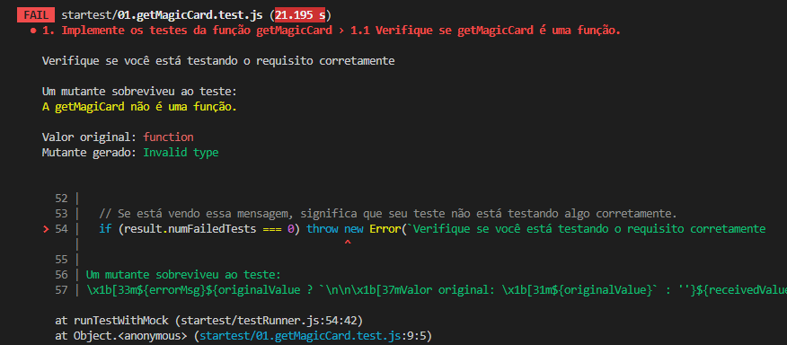

# Boas-vindas ao repositório do exercício Magic Card

Para realizar o exercício, atente-se a cada passo descrito a seguir, e se tiver qualquer dúvida, nos envie por _Slack_! #vqv 🚀
Aqui você vai encontrar os detalhes de como estruturar o desenvolvimento do seu exercício a partir deste repositório, utilizando uma branch específica e um _Pull Request_ para colocar seus códigos.

# Termos e acordos

Ao iniciar este exercício, você concorda com as diretrizes do [Código de Conduta e do Manual da Pessoa Estudante da Trybe](https://app.betrybe.com/manual-estudante/codigo-de-etica-e-conduta).

# Entregáveis

<details>
  <summary><strong>🤷🏽‍♀️ Como entregar</strong></summary><br />

  Para entregar o seu exercício você deverá criar um *Pull Request* neste repositório.

  Lembre-se que você pode consultar nosso conteúdo sobre [Git & GitHub](https://app.betrybe.com/course/4d67f5b4-34a6-489f-a205-b6c7dc50fc16/) e nosso [Blog - Git & GitHub](https://blog.betrybe.com/tecnologia/git-e-github/) sempre que precisar!
</details>

<details>
  <summary><strong>👨‍💻 O que deverá ser desenvolvido</strong></summary><br />

Nos exercícios de hoje, será usada uma API que retorna cartas do jogo de Magic: The Gathering. Então se prepare, jovem, pois neste dia, uma carta será comprada do Grimório e outras serão escolhidas como as favoritas. Está com mana suficiente para esta aventura?

Mas, antes de se aventurar nos exercícios, saiba que você encontrará imports no caminho. Os imports/requires são declarações de arquivos que possuem funções externas ao arquivo atual. Em algum momento, você pode precisar usar uma função ou variável que está declarada em outro arquivo, e, para resolver esse problema, é só importar esse arquivo ou apenas a função/variável desejada dentro do arquivo que você está desenvolvendo, isso faz parte do dia a dia de uma pessoa desenvolvedora. Nada complicado, certo? Hoje será necessário fazer alguns imports para a realização do exercício, mas não tenha medo, pois os arquivos já vão vir importados para você!

</details>

# Orientações

<details>
  <summary><strong>‼️ Antes de começar a desenvolver</strong></summary><br />

1. Clone o repositório
  * `git clone git@github.com:tryber/sd-029-b-exercise-magic-card.git`.
  * Entre na pasta do repositório que você acabou de clonar:
    * `cd sd-029-b-exercise-magic-card`

2. Instale as dependências e inicialize o exercício
  * Instale as dependências:
    * `npm install`

3. Crie uma branch a partir da branch `main`
  * Verifique que você está na branch `main`
    * Exemplo: `git branch`
  * Se não estiver, mude para a branch `main`
    * Exemplo: `git checkout main`
  * Agora, crie uma branch onde você vai guardar os `commits` do seu exercício
    * Você deve criar uma branch no seguinte formato: `nome-sobrenome-nome-do-exercicio`
    * Exemplo: `git checkout -b maria-silva-magic-card`

4. Quando fizer mudanças, adicione-as ao _stage_ do Git e faça um `commit`
  * Verifique que as mudanças ainda não estão no _stage_
    * Exemplo: `git status` (deve aparecer as alterações realizadas em vermelho)
  * Adicione o novo arquivo ao _stage_ do Git
      * Exemplo:
        * `git add .` (adicionando todas as mudanças - _que estavam em vermelho_ - ao stage do Git)
        * `git status` (deve aparecer listado os arquivos em verde)
  * Faça o `commit` inicial
      * Exemplo:
        * `git commit -m 'iniciando o exercício. VAMOS COM TUDO :rocket:'` (fazendo o primeiro commit)
        * `git status` (deve aparecer uma mensagem tipo _nothing to commit_ )

5. Adicione a sua branch com o novo `commit` ao repositório remoto
  * Usando o exemplo anterior: `git push -u origin maria-silva-magic-card`

6. Crie um novo `Pull Request` _(PR)_
  * Vá até a página de _Pull Requests_ do [repositório no GitHub](https://github.com/tryber/sd-029-b-exercise-magic-card/pulls)
  * Clique no botão verde _"New pull request"_
  * Clique na caixa de seleção _"Compare"_ e escolha a sua branch **com atenção**
    * Coloque um título para a sua _Pull Request_
    * Exemplo: _"Cria tela de busca"_
  * Clique no botão verde _"Create pull request"_
  * Adicione uma descrição para o _Pull Request_, um título claro que o identifique, e clique no botão verde _"Create pull request"_
  * **Não se preocupe em preencher mais nada por enquanto!**
  * Volte até a [página de _Pull Requests_ do repositório](https://github.com/tryber/sd-029-b-exercise-magic-card/pulls) e confira que o seu _Pull Request_ está criado

</details>

<details>
  <summary><strong>⌨️ Durante o desenvolvimento</strong></summary><br />

  * Faça `commits` das alterações que você fizer no código regularmente;

  * Lembre-se de sempre atualizar o repositório remoto após um (ou alguns) `commits`;

  * Os comandos que você utilizará com mais frequência são:

    1. `git status` _(para verificar o que está em vermelho - fora do stage - e o que está em verde - no stage)_;

    2. `git add` _(para adicionar arquivos ao stage do Git)_;

    3. `git commit` _(para criar um commit com os arquivos que estão no stage do Git)_;

    4. `git push -u origin nome-da-branch` _(para enviar o commit para o repositório remoto na primeira vez que fizer o `push` de uma nova branch)_;

    5. `git push` _(para enviar o commit para o repositório remoto após o passo anterior)_.

</details>

<details>
  <summary><strong>🤝 Depois de terminar o desenvolvimento (opcional)</strong></summary><br />

  Para sinalizar que o seu exercício está pronto para o _"Code Review"_, faça o seguinte:

  - Vá até a página **DO SEU** _Pull Request_, adicione a label de _"code-review"_ e marque quem você deseja que realize o _code review_, por exemplo, as pessoas da sua tribo:

  - No menu à direita, clique no _link_ **"Labels"** e escolha a _label_ **code-review**;

  - No menu à direita, clique no _link_ **"Assignees"** e escolha **o seu usuário**;

   - No menu à direita, clique no _link_ **"Reviewers"** e digite `students`, selecione o time `tryber/students-sd-0x`.

  Caso tenha alguma dúvida, [aqui tem um vídeo explicativo](https://vimeo.com/362189205).

</details>

<details>
  <summary><strong>🕵🏿 Revisando um pull request</strong></summary><br />

  Use o conteúdo sobre [Code Review](https://app.betrybe.com/course/real-life-engineer/code-review) para te ajudar a revisar os _Pull Requests_.

</details>

<details>
  <summary><strong>🎛 Linter</strong></summary><br />

### ESLint

Para garantir a qualidade do código, vamos utilizar neste exercício o linters `ESLint`.
Assim o código estará alinhado com as boas práticas de desenvolvimento, sendo mais legível
e de fácil manutenção!

Para poder rodar o `ESLint` certifique-se de ter executado o comando `npm install` dentro do exercício.

Para rodá-los localmente no exercício, execute os comandos abaixo:

```bash
  npm run lint
```

Se a análise do `ESLint` encontrar problemas no seu código, tais problemas serão mostrados no seu terminal. Se não houver problema no seu código, nada será impresso no seu terminal.

Você pode também instalar o plugin do `ESLint` no VSCode. Para isso, basta fazer o download do plugin `ESLint` e instalá-lo.

Em caso de dúvidas, confira o material do course sobre [ESLint](https://app.betrybe.com/course/real-life-engineer/eslint).

⚠️ **PULL REQUESTS COM ISSUES NO LINTER NÃO SERÃO AVALIADAS. ATENTE-SE PARA RESOLVÊ-LAS ANTES DE FINALIZAR O DESENVOLVIMENTO!** ⚠️

</details>

<details>
  <summary><strong>🛠 Testes</strong></summary><br />

  Neste exercício você desenvolverá os testes para funções assíncronas. Mas então, como o exercício será avaliado?

  ### Quem testa os testes?

  O avaliador automatizado **testará os testes de vocês!** A ideia dele é a seguinte: você vai escrever casos de teste para a aplicação, certo? E esses testes têm que garantir que a aplicação está funcionando, certo? Pois bem! Se eu quebro uma parte da aplicação, fazendo uma alteração no código, seus testes devem quebrar, certo? Pois é isso que o avaliador faz!

  Mas como assim? :thinking: 
  
  Pense da seguinte forma: nosso avaliador vai fazer várias mudanças no código original **para que ela quebre e pare de funcionar**. Em seguida ele vai rodar seus testes. Caso seus testes não acusem que a aplicação está com problemas, o avaliador não vai aprovar aquele requisito! Se, para todas as alterações que o avaliador fizer no código da aplicação, os seus testes acusarem problemas, tudo será aprovado! O avaliador garante, portanto, que seus testes, de fato, testam a aplicação como se deve.
  
  Na linguagem do avaliador, dizemos que cada mudança que o avaliador faz na sua aplicação é um **mutante**. O avaliador cria vários mutantes e seus testes **devem matar todos!** Se algum mutante sobreviver, temos problemas. Certo? Vamos aos requisitos então!

  ### Executando os testes localmente

  - Há uma pasta chamada `./startest` com diversos arquivos `0x.requisito.test.js`. Cada um deles é o teste do avaliador para um requisito e ele **não deve ser alterada**. 
  
  - Após finalizar os testes unitários de um requisito, para testá-lo, execute o comando abaixo:
  ```bash
  npm run test:dev
  ```

  Esse comando irá rodar os testes que você acabou de criar, é importante que todos eles estejam passando caso contrario o avaliador irá falhar na fase inicial, para então rodar o avaliador localmente você pode executar o comando:
  ```bash
  npm test
  ```

  Exemplo de testes falhando:

  

  Repare que na imagem, o requisito 1 está falhando e no terminal é possível verificar o motivo, nesse caso o requisito um pede que você teste se a função getMagicCard é uma função e caso você não teste isso corretamente a mensagem de erro irá te informar:
  * Qual o tipo do mutante
  * Qual o valor original
  * Qual o valor gerado pelo mutante

  Utilize essas informações para voltar no requisito e entender o que você deixou de testar.


  ⚠️ **O avaliador automático não necessariamente avalia seu exercício na ordem em que os requisitos aparecem no readme. Isso acontece para deixar o processo de avaliação mais rápido. Então, não se assuste se isso acontecer, ok?**
</details>

  <details>
  <summary><strong>🗣 Nos dê feedbacks sobre o exercício!</strong></summary> <br />

  Ao finalizar e submeter o exercício, não se esqueça de avaliar sua experiência preenchendo o formulário. Leva menos de 3 minutos!

  [FORMULÁRIO DE AVALIAÇÃO](https://be-trybe.typeform.com/to/ZTeR4IbH)

</details>

  <details>
  <summary><strong>🗂 Compartilhe seu portfólio!</strong></summary><br />

  Você sabia que o LinkedIn é a principal rede social profissional e compartilhar o seu aprendizado lá é muito importante para quem deseja construir uma carreira de sucesso? Compartilhe esse exercício no seu LinkedIn, marque o perfil da Trybe (@trybe) e mostre para a sua rede toda a sua evolução.

</details>

# Exercícios

**⚠️ Atenção**

### Informações importantes para os requisitos 1 e 2:

* Todas as funções já estão implementadas, você precisará se preocupar apenas em testá-las.

**Dica de ouro**: leia e entenda cada parte da implementação da função `getMagicCard` que está no arquivo `src/magic.js`. Isso te ajudará a implementar os testes.

**Outra dica de ouro**: a função `getMagicCard` com o argumento que vamos usar durante esse exercício, "**130550**", vai retornar o seguinte objeto:
```javascript
{
  name: "Ancestor's Chosen",
  manaCost: "{5}{W}{W}",
  types: [ "Creature" ],
  subtypes: [ "Human", "Cleric" ],
  rarity: "Uncommon",
}
```

Você deverá remover os comentários do código sempre que necessário a medida que desenvolve os requisitos.

## 1. Implemente os testes da função `getMagicCard`

<details>
<summary>Implemente um teste para cada verificação dentro do arquivo <code>tests/magic.test.js</code></summary><br />

   1. Verifique se `getMagicCard` é uma função.
   2. Verifique se, ao chamar a função `getMagicCard`, a função *fetch* foi chamada.
   3. Verifique se, ao chamar a função `getMagicCard` com o argumento "**130550**", a função *fetch* foi chamada com o endpoint "https://api.magicthegathering.io/v1/cards/130550".
</details>

## 2. Verificando o retorno da função `getMagicCard`
<details>
<summary>Ainda dentro do arquivo <code>magic.test.js</code> no segundo describe, implemente os seguintes testes</summary><br />

  1. Verifique se a propriedade `name` retornada pela função `getMagicCard` possui valor `Ancestor's Chosen`.
      - ***Dica***: você pode desestruturar o objeto response e obter diretamente suas propriedades.
</details>

---

### Informações importantes para os requisitos 3 e 4:

* Dentro da pasta `src/data`, você encontrará o arquivo `favoriteCards`, leia e compreenda sua estrutura para realizar os exercícios.
* A função `saveFavoriteMagicCard`, além de realizar a chamada a API, ela também modifica o arquivo `favoriteCards`, adicionando um novo card a cada execução.

Agora temos um arquivo com algumas das cartas preferidas do nosso jogador. Você pode verificar a sua estrutura no arquivo `data/favoriteCards.js`. Utilizaremos este arquivo para os próximos passos.

**Dica de ouro**: leia e entenda cada parte da implementação da função `saveFavoriteMagicCard` que está no arquivo `src/magic.js.` Isso te ajudará a implementar os testes.

## 3. Implemente os testes da função `saveFavoriteMagicCard`

<details>
<summary>Implemente um teste para cada verificação dentro do arquivo <code>tests/saveFavoriteCard.test.js</code></summary><br />

  1. Implemente um teste que verifique que após a execução da função `saveFavoriteMagicCard`, `favoriteCards` passa a possuir `length === 5`.
     - Dentro do mesmo it, implemente um teste que verifique que na última posição do array `favoriteCards` existe um card com o a propriedade `name` e valor "Beacon of Immortality".
     - Ainda no mesmo it, chame a função `saveFavoriteMagicCard` com o argumento "**130554**" e verifique se `favoriteCards` passa a possuir `length === 6`.

  #### Para os próximos exercícios, desfaça os comentários o teste dentro do escopo do segundo it.
  Após desfazer os comentários o teste dentro do segundo it, rode os testes. 

  Você vai perceber que o teste falhou. Consegue entender porque ele falha? 

  <details>
  <summary>Resposta</summary><br />
  
  Isso mesmo, a função `saveFavoriteMagicCard` modificou o arquivo `favoriteCards` no escopo do it anterior. Desta maneira, para o Jest, o array `favoriteCards` não possui quatro cards, mas sim, seis.
  </details>

  2. Implemente a função `restoreFavoriteCards` com uma lógica capaz de restaurar o array `favoriteCards` ao seu valor original, depois chame essa função dentro do método `afterEach` para os testes poderem passar.

</details>

# Bônus


## 4. Verifique os nomes das cartas favoritas

<details>
<summary>Implemente um teste para cada verificação dentro do arquivo <code>tests/saveFavoriteCard.test.js</code></summary><br />


  * Este exercício deve ser realizado após a implementação da função `afterEach` do requisito 3.
  * Implemente o teste solicitado dentro do escopo do segundo `it`.

  1. Utilizando a função `map`, crie um array contendo apenas a propriedade `name` de todos os cards presentes no deck original, ou seja, no `favoriteCards`. Este array deve conter quatro nomes e deve ser salvo em uma nova variável.
      - Implemente um teste que verifique que o array que você obteve com o `map` contém a seguinte estrutura e valores:

```js
['Ancestor\'s Chosen', 'Angel of Mercy', 'Aven Cloudchaser', 'Ballista Squad']
```

</details>
